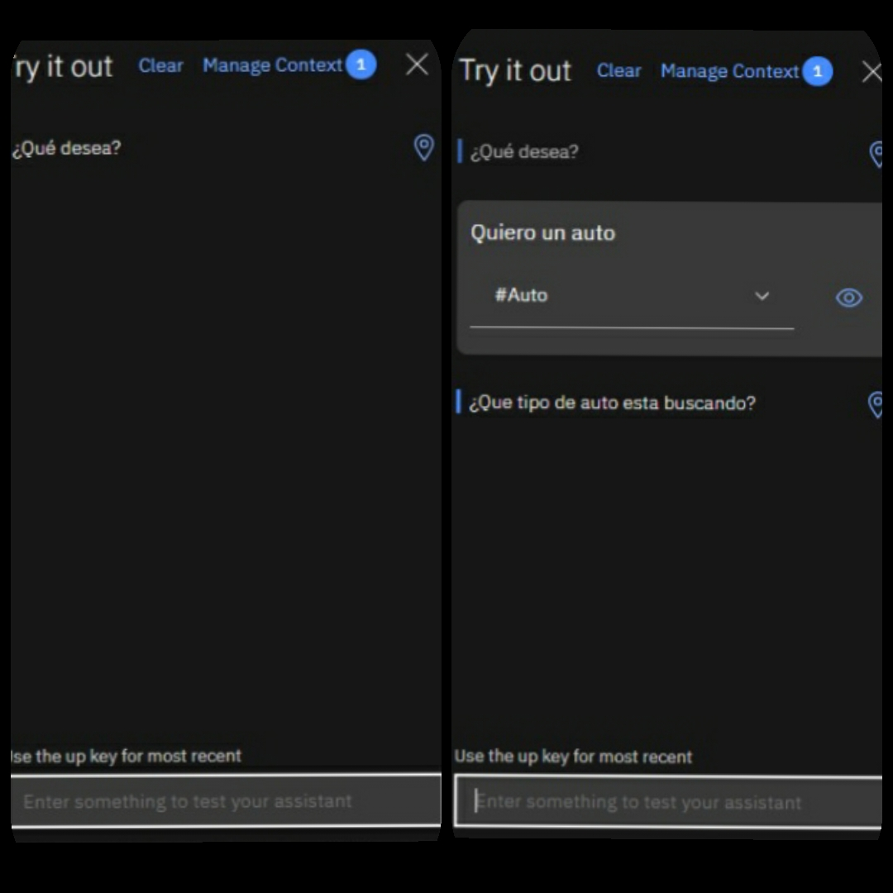

<H2>INFORME</H2>

<H3>1. PLANTEAMIENTO DEL PROBLEMA</H3>

Un chatbot es una aplicación de inteligencia artificial (IA) que puede imitar una conversación real conversation con un usuario con un lenguaje natural. Los chatbots permiten una conversación via texto o por métodos auditivos en páginas web, aplicaciones de mensajería, aplicaciones móviles o por teléfono.

Un bot de charla o bot conversacional (en inglés, chatbot) es un programa que simula mantener una conversación con una persona al proveer respuestas automáticas a entradas hechas por el usuario. Habitualmente, la conversación se establece mediante texto, aunque también hay modelos que disponen de una interfaz de usuario multimedia. Más recientemente, algunos comienzan a utilizar programas conversores de texto a sonido (CTV), dotándolo de mayor realismo a la interacción con el usuario.

Para establecer una conversación han de utilizarse frases fácilmente comprensibles y que sean coherentes, aunque la mayoría de los bot conversacionales no consiguen comprender del todo. En su lugar, tienen en cuenta las palabras o frases del interlocutor, que les permitirán usar una serie de respuestas preparadas de antemano. De esta manera, el bot es capaz de seguir una conversación con más o menos lógica, pero sin saber realmente de qué está hablando.

<H3>2. OBJETIVOS</H3>
<b>Objetivos Generales</b>

- Realizar un video explicando e identificando los topicos mas relevantes a manera de un tutorial sobre el tema asignado.

- Conocer la herramineta proporcionada por IBM para la creacion de chatbot.

<b>Objetivos Específicos</b>

- Emplear las herramientas que nos brinda IBM Watson.

- Analizar la plataforma IBM Watson para la creacion del chatbot.

- Implementar un ejemplo funcional sobre un chatbot.

<H3>3. ESTADO DEL ARTE</H3>
<b>	ChatBot</b> 

La inteligencia artificial (IA) permite, a partir de algoritmos, crear recursos que simulen la capacidad del ser humano. La creación de un chatbot no es más que un sistema que piensa racionalmente dentro de lo debido, pero la pregunta es, ¿Es posible crear un sistema racional escalable?. Pues bien, comprobamos en este proyecto que el aprendizaje profundo/automático nos permite a través de una base de datos dinámica, crear un código capaz de gestionar un sistema que pueda pasar de 10 a 500 procesos sin sufrir ninguna alteración de peso en este. LUIS es nuestro aprendizaje profundo/automático y C# es el lenguaje que nos permite crear las funciones para darle un recorrido lógico a las tablas dinámicas de nuestra base de datos. A partir de todos estos conceptos el resultado refleja un recurso estable y capaz de adquirir conocimiento en grandes cantidades, destinado a ofrecer la información que almacena de manera lógica. Al final, nuestro sistema escalable (chatbot) evita errores de gestión, acelera los procesos, aumenta la eficacia del beneficiario y permite la posibilidad de crecer acorde con su funcionalidad.  

- Fuente: Universitat Oberta de Catalunya (UOC) | Chatbot. (n.d.). Recuperado en Septiembre 06, 2020, de http://openaccess.uoc.edu/webapps/o2/handle/10609/96867

<b>los chatbots en educación</b>

Los chatbots son programas informáticos que integran inteligencia artificial y que pueden simular, en mayor o menor grado, una conversación humana. Se están volviendo populares ya que funcionan con lenguaje natural y tienen una interfaz de usuario basada en la conversación, muy común en las aplicaciones de mensajería instantánea de teléfonos inteligentes. Se exploran las potencialidades del uso de los chatbots en educación, no tanto para asumir el papel de profesor, sino para ocuparse de aquellas tareas desempeñadas por los docentes que son repetitivas y de bajo nivel cognitivo. En educación, los chatbots pueden funcionar como asistentes virtuales para mejorar la productividad o simplemente para dar respuesta a preguntas más frecuentes (FAQs). Además, hay chatbots con un claro objetivo educativo que funcionan como tutores a lo largo de todo el proceso de aprendizaje.  

- Fuente: Universitat Oberta de Catalunya (UOC)| los chatbots en educación. (n.d.). Recuperado en Septiembre 06, 2020, de http://openaccess.uoc.edu/webapps/o2/handle/10609/85786

<b>Chatbots en redes sociales para el apoyo oportuno de estudiantes universitarios con síntomas de trastorno por déficit de la atención con hiperactividad</b>

Se estima que la prevalencia del trastorno por déficit de atención con hiperactividad (TDAH) en estudiantes universitarios es del 2 al 4.5% pero varía de una universidad a otra. Sin embargo, muchos estudiantes evitan acudir a tratamiento por ansiedad, temor al estigma, porque sienten que los problemas de los otros son mayores que los propios o bien desconocen la sintomatología del TDAH. En esta contribución se presenta el diseño e implementación de un chatbot para la aplicación del cuestionario Adult Self Report Scale-Versión 1.1 (EATDAH-A) así como los resultados de la aplicación del mismo y la opinión de los usuarios en cuanto a su utilidad y experiencia como usuario.   

- Fuente: Revista Iberoamerica de Tecnologia en eduacion y educacion en tecnologia | Chatbots en redes sociales para el apoyo oportuno de estudiantes universitarios con síntomas de trastorno por déficit de la atención con hiperactividad (n.d.). Recuperado en Septiembre 06, 2020, de http://teyet-revista.info.unlp.edu.ar/TEyET/article/view/1158

<H3>4. MARCO TEORICO</H3>
<H3>4.1 Chatbot</H3>

Los chatbots tienen su origen en 1966, cuando Joseph Weizenbaum creó el primer chatbot basado en inteligencia artificial, Eliza, que actuaba como terapeuta.

Quizás comenzaron como un juego, pero hoy en día están muy extendidos. Muchos tienen su razón de ser e incluso esa razón es de bastante utilidad para todos. Los bots más clásicos y tempranos, además de Eliza, son SmarterChild, Parry y SHRDLU; entre los más recientes se encuentran Racter, A.L.I.C.E o Jabberwacky, Dr. Abuse (de Barres&Boronat), muy parecido a Eliza y Semantycs (de Full on Net) que ya puede interactuar con diversos canales y extraer información de ERP.

Los más avanzados, son programas capaces de mantener una conversación lógica y pseudo inteligente en un determinado idioma. Algunos de los más complejos están programados en C++, Delphi o similares, y otros más sencillos en Action Script, PHP, VBScript, etc. Pueden ser consultados además de mediante software instalado en un ordenador personal, vía web y vía aplicaciones instaladas en teléfonos inteligentes (entre las mismas, cabe mencionar a Siri y SimSimi,entre otros muchos). Existen muchos otros con amplia presencia en redes de IRC, donde son conocidos como bots de charla o bots de chat.

-Imagen de un chatbot Fuente:https://www.analiticaweb.es/microsoft-bot-hackaton/ 

<H3>4.2 IBM Watson</H3>

Watson es un sistema informático para búsqueda de respuestas (question answering en inglés), desarrollado por IBM.1​ La corporación lo describe como "una aplicación de tecnologías avanzadas diseñadas para el procesamiento de lenguajes naturales, la recuperación de información, la representación del conocimiento, el razonamiento automático, y el aprendizaje automático al campo abierto de búsquedas de respuestas," que es "construido en la tecnología DeepQA de IBM para la generación de hipótesis, la recopilación de pruebas masivas, el análisis y la calificación."

Watson es una inteligencia artificial que es capaz de responder a preguntas.... formuladas en lenguaje natural, desarrollado por la empresa estadounidense IBM. Forma parte del proyecto del equipo de investigación DeepQA, liderado por el investigador principal David Ferrucci. Lleva su nombre en honor del fundador y primer presidente de IBM, Thomas J. Watson.

Watson responde a las preguntas gracias a una base de datos almacenada localmente.4​ La información contenida en esa base de datos proviene de multitud de fuentes, incluyendo enciclopedias, diccionarios, tesauros, artículos de noticias, y obras literarias, al igual que bases de datos externos, taxonomías, y ontologías (específicamente DBpedia, WordNet)

-IBM Watson. Fuente: https://cambiodigital-ol.com/2019/01/ibm-pone-fin-a-su-aplicacion-watson-workspace/

<H3>4.3 Apartados Watson</H3>
<b>Intents</b>

Son propósitos u objetivos que se expresan en la entrada de un cliente, tales como responder a una pregunta o procesar un pago de factura. Al reconocer la intención expresada en una entrada de cliente, el servicio Watson Assistant puede elegir el flujo de diálogo correcto para responder a la misma.

-Para definir un  intento se debe nombrarlo antecedido de un simbolo numeral.

-Hay que añadir una descripcion de intento en esta se puede colocar palabras clave sobre lo que se quiere que haga el chatbot.

-Se define ejemplos de preguntas que el chat bot puede aceptarlas como el indicador de inicio de dialogo.

<b>Entities</b>

Se utilizan para identificar partes interesantes del enunciado del usuario, como nombres y fechas. Watson Assistant ya proporciona entidades del sistema (para fecha, hora, nombres, etc.) y le permite definir entidades con sinónimos y coincidencia aproximada, así como definir entidades basadas en patrones

-Para definir una entiti es nesesario hacerlo con el caracter especial del arroba.

-Hay que añadir un valor y varios de los sinonimos que nos expresen las caracteristicas propias del objeto definido.

-Al definir los objetos se almacena en una base de datos la cual nos proporcionara los objetos expuestos para posteriormente dar respuestas a las preguntas planteadas por los usuarios.

<b>Dialog</b>

Define lo que dice su asistente en respuesta a los clientes

-Para la utilizacion de este submenu se hace uso de odos los cuales son configurables con diferentes aspectos.

-para la configuaracion de los saludos se debe abrir la configuaracion del nodo saludo en el cual se puede aumentar diferebtes tipos de saludos haciendo una seleccion aleatoria de los mismos para evitar caer en la monotonia de la charla.

-Se añade nodos como puede ser el de charla para configurar las diferentes respuestas ademas  de poder ingresar diferentes enlaces a paginas en las cales puede dar respuesta al problema planteado.

<b>Options</b>

El texto que agrega como etiqueta se muestra en la respuesta al usuario como una opción seleccionable.

<b>Analytics</b>

 es un servicio inteligente de análisis y descubrimiento de datos disponible en la nube.  Ayuda a descubrir patrones y significado en datos. Utiliza un lenguaje natural y puede descifrar casi cualquier idioma.

<b>Versions</b>

 ayudan a gestionar el flujo de trabajo de un proyecto de desarrollo de conocimientos de diálogo.Cree una versión de conocimiento para capturar una instantánea de los datos de entrenamiento (intenciones y entidades) y un diálogo en el conocimiento en puntos clave durante el proceso de desarrollo.

<b>Content Catalog</b>

ofrecen un método sencillo para añadir intenciones comunes al conocimiento de diálogo de Watson Assistant.Las intenciones que añade desde el catálogo están pensadas para proporcionar un punto de partida. Añada o edite intenciones de catálogo para adaptarlas a su caso de uso.

<H3>5. DIAGRAMAS</H3>

<b>Funcionamiento</b>

<b>Al correr la simulacion  nos mostrar los saludos antes puestos despues el usuario tien que digitar la pregunta y el bot le responder de la base de datos de las respuestas que anteriormente se registraron para este caso en especifico nos mostrar la pregunat¿ Qué tipo de auto desea?.</b>

<b>Al relalizar los primeros pasos el bot nos pide o se infiere que se debe realizar el ingreso del tipo de vehiculo , el bot respondera  con una de las multiples respuesta ingresadas en el banco de respuestas.</b>

<H3>6. LISTA DE COMPONENTES</H3>

<b>IBM Watson</b>

- Accseso a internet 
- Correo electronico 
- Cuenta en IBM Watson 
- Idea o nesecidad para plantear el chatbot 
- Accseso a un computador 

<H3>7. MAPA DE VARIABLES</H3>

<H3>8. EXPLICACION DEL CODIGO FUENTE</H3>

El proyecto no posee codigo fuente ya que es creado en una plataforma virtual.

<H3>9. DESCRIPCION DE PRERREQUISITOS Y CONFIGURACION</H3>

Se necesita una cuenta de  IBM Watson la cual nos proporcionara las herramientas para la creacion de un chatbot como se mostrar el video anexado en el informe, ademas de proporcionar las herramientas no mustra una gia basicala cual nos indica los primeros pasos a seguir para la creacion del lchat bot eñl cual sera una respuesta a la nesecidad que aqueja al solicitante

<H3>10. APORTACIONES</H3>

Como instalar un chatbot en una pagina web

<b>Chatbot</b>

En nuestro caso, para instalar el chat de nuestra web optamos por una herramienta gratuita y muy versátil que ofrece muchas opciones y además es fácil de configurar. Esta herramienta se llama tawk.to y te proporcionará todo lo que necesitas para atender a tus visitantes de manera excelente y totalmente gratis. Ofrece estadísticas de visitas, monitorización en tiempo real, sistema de tickets, mensajes automáticos, app para el móvil y muchas funcionalidades más. Por supuesto, tiene también versión de pago que permite opciones adicionales pero te aseguro que con la versión gratuita te bastará para tener en tu web un sistema de chat de alta calidad.

<b>Tawk.to</b>

es una aplicación de mensajería gratuita que le permite monitorear y conversar con los, visitantes en su sitio web, aplicación móvil o desde una página personalizable gratuita. Copie una línea simple de Javascript en el html de su sitio web y el widget de chat comienza a funcionar al instante.

Inicie sesión en el panel para invitar a miembros de su equipo, crear accesos directos y comenzar a chatear con sus visitantes. Controle y rastree su progreso y el de sus equipos a lo largo del tiempo, revise el historial de chat y verifique el rendimiento en análisis.

Usted nunca tendrá que pagar por el software de chat en vivo de nuevo. ¿Cansado de pagar una suscripción mensual ‘por agente’? Bueno, puedes cancelar oficialmente tu suscripción actual, ya que tawk.to es completamente gratuito y siempre lo será.

Las compañías más grandes de la web, y posiblemente los mejores productos, casi siempre son gratuitas. De Facebook a Google, Twitter e Instagram: gratis no significa barato.

tawk.to está repleto de todas las características que necesita para proporcionar soporte al cliente ganador: es rapidísimo, confiable y escalable. Si ya usa el chat en vivo en su sitio, ¡realmente no hay razón para seguir pagando por agente!

<H3>11. CONCLUSIONES</H3>

Realizada la investigación sobre los chatbots y la realización del ejemplo funcional se llegó a las siguientes conclusiones: 
-	Mediante la investigación y la implementación del ejercicio propuesto se llegó a conocer que varias de las herramientas proporcionadas por Watson son para el mejoramiento e implementación de detalles al chatbot  
-	Se implementó de manera exitosa un ejemplo funcional de un chatbot con idea de automóviles 
-	Se logró simular de manera exitosa ya que la misma plataforma nos presta un simulador en el cual se puede interactuar con el chatbot.  
Después de haber logrado los objetivos específicos se llegó a la conclusión que gracias a estos objetivos específicos se lograra llegar a la implementación y la realización de los objetivos generales. 
- Durante el estudio de esta asignatura se mostró que los temas presentados en clase son solo el comienzo de lo que es la materia gracias a lo cual se puede aumentar el conocimiento  adquirido en el semestre.

<H3>12. RECOMENDACIONES</H3>

-Durante el estudio de esta asignatura se mostró que los temas presentados en clase son solo el comienzo de lo que es la materia gracias a lo cual se puede aumentar el conocimiento  adquirido en el semestre.  
-	Conocer las diferentes herramientas no es suficiente para estar preparados  para los casos que se presentan en la vida real  
- Conocer los distintos de chatbots de los cuales se puede hacer uso para dar solución a los distintos problemas que pueden presentarse. 

<H3>13. CRONOGRAMA</H3>

<H3>14. BIBLIOGRAFIA</H3>

-	Natalya N. Bazarova, Yoon Hyung Choi, Victoria Schwanda Sosik, Dan Cosley, and Janis Whitlock. Social Sharing of Emotions on Facebook: Channel Differences, Satisfaction, and Replies. In Proc. of CSCW, 2015, 154--164  
-	I.S.  Jacobs  and  C.P.  Bean,  “Fine  particles,  thin films  and  exchange  anisotropy,”  in  Magnetism, vol. III, G.T. Rado and H. Suhl, Eds. New York: Academic, 1963, pp. 271-350.  
- Joan-Isaac Biel, Oya Aran, and Daniel Gatica-Perez. You Are Known by How You Vlog: Personality Impressions and Nonverbal Behavior in Youtube. In Proc. of ICWSM, 2011, 446--449.  
- Keith S. Coulter, Johanna Gummerus, Veronica Liljander, Emil Weman, and Minna Pihlström. Customer Engagement in a Facebook Brand Community. Management Research Review, 2012, 35, 9, 857--877.   
-	Weizenbaum, Joseph. "ELIZA---a computer program for the study of natural language communication between man and machine." Communications of the ACM 9.1 (1966): 36--45.  
- Definición de CPU » ]  AskTanmay, https://github.com/tanmayb123/AskTanmay.  

<H3>15. ANEXOS</H3>
<H3>15.1 MANUAL DE USUARIO</H3>

Adjunto en la carpeta Manual de Usuario.

<H3>15.2 HOJAS TECNICAS</H3>

El proyecto no posee hojas tecnicas.

